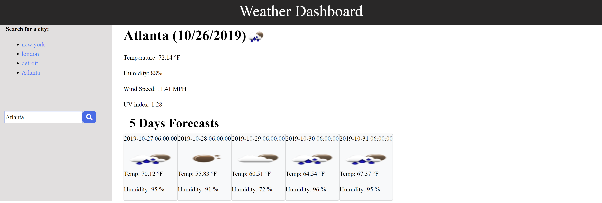

# Weather Dashboard

#### Purpose

The purpose of this homework assignment is to learn about the API aspects as well as how to retrieve the API from the server and be able to access contents within and output it to the DOM. We also use functions as well as local storage to store previous API data.

#### Functionality

The functionality of this project is to allow users to get the current weather data as well as data that is fives days from now. This include many different countries as well as diffrent cities around the world. People can also use country code along with city name to retrieve the API call if needed.

Link to github page: https://ductran963.github.io/weatherForecast/

Password Generator image:

